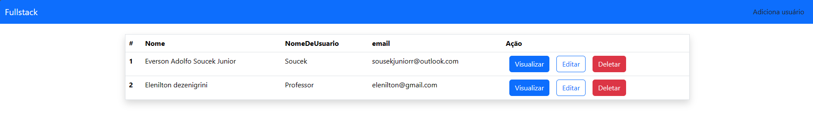

# Projeto FullStack Com spring boot e React

Este é o front end do projeto onde se pode Adicionar, editar, visualizar e deletar usuários tudo com uma conexão ao banco de dados

## :hammer: Funcionalidade do projeto

Um sistema com as funcionalidades de adicionar, editar, visualizar e deletar usuários com todas essas operações ligadas ao um banco de dados

## :wrench: Técnicas e tecnologias utilizadas

- ⚛️ `React`
- 📡 `React router dom`
- 🅱️ `Bootstrap`
- ↕️ `Axios`

## :file_folder: Acesso ao projeto

Primeira opção:
Você pode acessa o projeto e baixar ele pelo <a href="https://github.com/EversonSoucek/Front-endSpring">Github</a>
